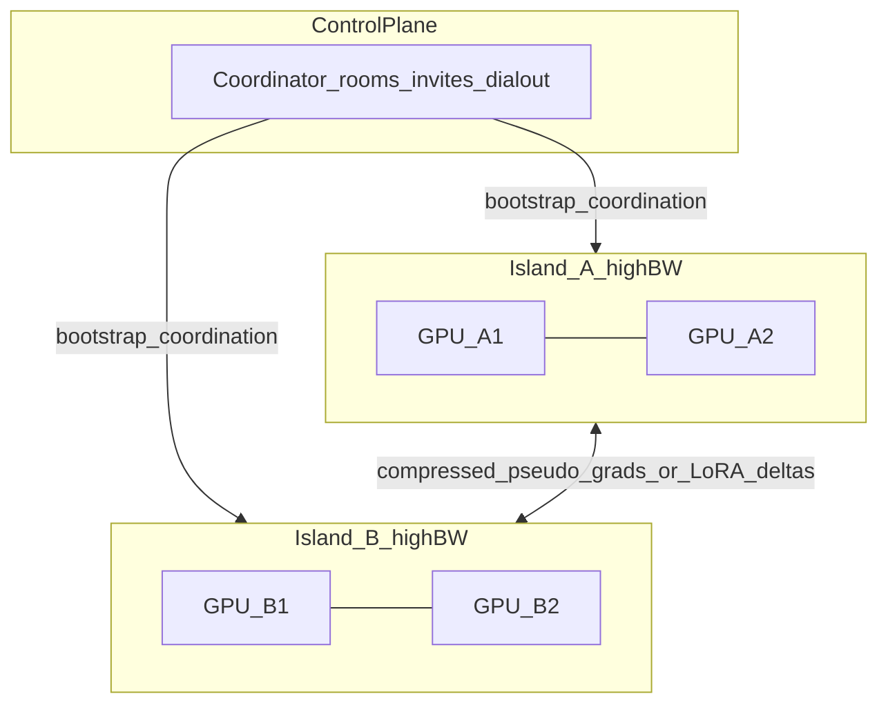

# Phase 9 Playbook: Cloud Deployment + Distributed LLM Training
 
**Status:** Architecture decisions locked; execution playbook 
**Related:** [zepgpu_petals_room_network_implementation_plan.md](zepgpu_petals_room_network_implementation_plan.md) owns room API Phases 0–8; this doc owns cloud packaging, dial-out networking, and the training data plane after that baseline.

Link N devices (e.g. four machines in a group) so they can **pool VRAM/RAM**, **train and fine-tune LLMs over consumer internet**, and **drastically reduce the communication-to-compute ratio** until GPU utilization approaches literature-class levels on ~100–1000 Mbit/s links. Hardware priority: NVIDIA consumer GPUs (PyTorch). Apple/MLX and mixed rooms come later as islands + a neutral outer exchange format.

# A. Observations

## A1. Product / metric

**O1 — Metric is communication-to-compute ratio.**  
Define `ratio = blocked_comms_time / useful_compute_time` (or bytes exchanged per useful FLOP). Goal: ratio ≪ 1, ideally comms fully overlapped so utilization approaches literature results on home WAN. Do **not** treat >~90% util as a hard MVP gate on consumer single-GPU nodes — that figure comes from multi-H100 OpenDiLoCo runs (see O10); always document measured util on the hardware under test.

**O2 — Memory wall comes before compute optimization.**  
Training must hold activations + weights/biases + gradients + optimizer states at once. A ~7B model in FP32 is often ~100GB+ of state vs an H100’s 80GB (consumer cards are smaller). Memory scales roughly with the square of embedding/sequence dimensions for activation-heavy paths. If you are stuck at OOM, GPU compute tuning is still secondary (Vyas, *Scaling LLM Pretraining — Part 1*). Implies: mixed precision first; then decide *how* to pool RAM across devices.

**O3 — Data movement is the bottleneck at every tier.**  
Inside a GPU: HBM (~2 TB/s) → L2 → SM registers (~15–20 TB/s); tensors are tiled into tensor cores then written back — the bottleneck is memory transfer (Vyas, *Part 2*). The same principle scales: PCIe/NVLink → LAN → WAN. At cluster scale, inter-node communication is the analogue of HBM↔SM transfer — hence O1.

## A2. Current stack blockers (training)

**O4 — Remote task path is pickle/base64/HTTP one-shot.**  
`deepiri_zepgpu/vpn/task_router.py` pickles func/args/kwargs, base64-encodes them into JSON, POSTs to `http://{peer_vpn_ip}:9092/execute`. `peer_node.py` unpickles and runs once. No zero-copy tensors, no gradient compression, no collectives. Unsuitable as a training wire. **Quarantine:** training never uses this path; after P3 it remains only behind `transport_mode=wireguard` for legacy one-shot remote exec.

**O5 — Seconds-scale polling; no long-lived process groups; remote room path is noop.**  
Poll intervals ~2–5s across task router, node agent, and pipelines. Celery defers room-assigned tasks; node agent remote execution is intentionally noop-only. `ResultStore` tiers (≤1MB Redis / ≤100MB S3) are job-result storage, not a per-step gradient bus. Training needs persistent workers and binary compressed updates. Prefer **WSS push assignment** over poll-only claim.

**O6 — Training frameworks are optional extras, not the engine.**  
Core deps: cloudpickle, nvidia-ml-py. Torch/JAX are optional. No DiLoCo, DeMo, NCCL, Gloo, or PCCL in core. Gang scheduling is local multi-GPU only (`CUDA_VISIBLE_DEVICES` on one worker).

## A3. Networking / deployment

**O7 — WireGuard-hub rooms need a public UDP endpoint and break under hard NAT.**  
`vpn/config.py` defaults WG port 51820; TaskRouter assumes peer VPN IP reachability. Symmetric NAT/CGNAT and missing port-forwards fail joins. Lifting the hub to a VPS is transitional only — not the long-term exclusive transport.

**O8 — Dial-out HTTPS/WSS + relay overlay is the correct join model.**  
Mesh-LLM (invite join, iroh relays, bind-IP awareness) and exo (libp2p/mDNS, coordinator-only nodes) show providers should dial out; control plane stays separate from data plane. **Decision:** dual-plane hybrid with relay-assisted provider overlay (managed or self-hosted coordinator). Overlay default for hard NAT is **iroh** (see ADR appendix).

**O9 — Managed vs self-hosted control plane is the same Compose artifact.**  
Difference is who runs the URL and who pays. Agents always join with `--coordinator <url>`. Self-host still needs a reachable coordinator URL (public VPS, tunnel, or LAN-only rooms).

## A4. Research takeaways

**O10 — Low-comms DP is proven at 100–2000× less traffic (with hardware caveats).**  
DiLoCo (inner AdamW / outer Nesterov, H≈500) ≈ **500×** less frequent sync. Streaming DiLoCo (subset sync + overlap + 4-bit) ≈ **400×** bandwidth with lower peak. Eager DiLoCo overlaps outer all-reduce with the next inner window. DeMo/DisTrO (DCT + top-k + error feedback) ≈ **10³–10⁵×** less volume, drop-in AdamW replacement. INTELLECT-1 DiLoCo+FSDP2+int8 ≈ up to **2000×**. OpenDiLoCo reported 90–95% compute utilization across continents on 127–935 Mbit/s — but that run used **four workers × eight H100s**, not consumer single-GPU home nodes. OpenReview also notes DiLoCo is not always a drop-in DDP replacement over short horizons (compute-efficiency tradeoffs). **Product implication:** treat literature util as an aspirational target; gate phases on measured ratio/bytes/step and documented util on RTX-class hardware.

**O11 — FSDP/ZeRO RAM pooling is island-only.**  
ZeRO-3/FSDP ≈ 8× less memory per GPU at ~1.5× communication, but needs **200–400+ Gbps** for good utilization. Tensor parallel needs NVLink/Thunderbolt RDMA — not WAN. **Decision:** pool RAM inside high-bandwidth islands; across the internet use DiLoCo/DeMo data parallel.

**O12 — LoRA/QLoRA is the first buildable WAN training path.**  
Adapters ~50–100MB vs ~140GB full updates (>99.9% reduction). QLoRA 4-bit bases fit large models on one consumer GPU. Fed-SB-style methods can cut adapter traffic further (~230×). Start here before full pretrain.

**O13 — exo/MLX = islands; Mesh-LLM = WAN bootstrap — neither is the training optimizer.**  
exo/MLX+JACCL prove Apple Silicon islands (TP + LoRA fine-tune on Thunderbolt). Mesh proves dial-out, relays, invites. Training engine = PyTorch + DeMo/DiLoCo (+ FSDP2 in islands), not Skippy inference or exo’s cluster alone.

**O14 — Adapter size alone is not enough under heterogeneity.**  
Home rooms mix GPU tiers and link speeds. Forcing one LoRA rank and full participation every outer round recreates stragglers. Heterogeneous LoRA ranks and bandwidth-aware peer sampling (see **R3**, **R7**) keep weak devices useful without waiting on them every sync.

**O15 — Outer sync volume can still be sparsified.**  
Even after LoRA + infrequent DiLoCo H, outer/pseudo-grad messages can be compressed further with SparseLoCo- or CocktailSGD-class stacks (top-k + quantization + error feedback; see **R1**, **R2**, **R10**). Frequency reduction and volume reduction compound.

---

# A5. Target architecture

| Tier | Role | Tech |
|---|---|---|
| Control plane | Auth, rooms, invites, heartbeats, task/run lifecycle, WS | FastAPI, Postgres, Redis, Celery; managed or self-hosted Compose |
| Provider agents | Dial-out join, heartbeat, claim work | HTTPS/WSS (WSS push primary; HTTPS claim fallback); no inbound ports for typical NAT |
| Island (high BW) | Pool RAM; fit base model | FSDP2 and/or TP on NVLink / PCIe / Thunderbolt+JACCL |
| Inter-island (WAN) | Low-comms data parallel | **PCCL** collectives default; DeMo optimizer; DiLoCo outer loop; 4–8 bit / DCT top-k; Eager/Streaming overlap |
| Hard-NAT data plane | Direct peer bytes when possible | **iroh** QUIC direct→relay (P9); coordinator HTTPS/WSS **blob relay** as P6a MVP fallback |
| Legacy remote exec | One-shot WG tasks only | `TaskRouter` pickle/HTTP — **quarantined**; never used for training; gated to `transport_mode=wireguard` after P3 |

**Non-goals:** gossip-only room membership; Nostr public rooms as day-one; Skippy/MLX as cloud foundation; pickle-over-HTTP training; requiring InfiniBand for MVP LoRA; WAN pipeline parallelism (Petals/prime-iroh style) as the MVP training path (post-P10 research fork only); public blockchain incentives as a training prerequisite (permissioned compute ledger may attest run credits later — see Deferred).

---

# B. Phases

## Phase P0: Dial-out agent + join UX — PLANNED

**Goal:** A provider behind NAT joins a room with outbound-only networking and a one-line CLI.  
**Depends on:** Room claim path works locally (room APIs, dispatch, and noop node agent already in tree).  
**Owns:** `deepiri_zepgpu/vpn/peer_node.py`, `relay_client.py`, `cli.py`; agent routes under rooms/VPN; `deepiri_zepgpu/node_agent/`; `docs/room_network_local_testing.md`  
**Intended improvement:** Zero inbound ports required for join + heartbeat + task claim/result; copy-paste join works.  
**Reasoning:** O7–O8 — WG hub fails NAT; Mesh-style dial-out unlocks real multi-user rooms before any training work.

### Tasks

- [ ] Expand `RelayVpnClient` beyond heartbeat: invite redeem, peer register, claim task, post result
- [ ] Prefer **WSS push assignment** as primary; HTTPS claim as fallback; no inbound `/execute` for MVP dial-out rooms
- [ ] CLI: `zepgpu-node join --invite <code> --coordinator <url>`, `serve`, `status`
- [ ] Persist agent credentials under `~/.zepgpu/agent.json`
- [ ] UI invite copy includes coordinator URL + one-liner join command
- [ ] Simulated dial-out agent mode for Phase 8 local testing docs
- [ ] Tests under `tests/vpn/` for join, heartbeat, claim, revoke

### Acceptance criteria

- Provider behind NAT (no port forward) appears in room dashboard
- Host dispatches no-op; agent completes via claim/result
- Invalid/expired/revoked invite fails clearly
- Killing agent marks peer unhealthy after heartbeat timeout

### Out of scope for this phase

- WireGuard deprecation; overlay/iroh; training workers; agent JWT hardening beyond minimal token stub (see P2)

---

## Phase P1: Coordinator packaging (managed + self-hosted) — PLANNED

**Goal:** One reproducible Compose stack that runs as managed SaaS or user self-host.  
**Depends on:** None for packaging; P0 for end-to-end smoke against a public URL.  
**Owns:** `docker/docker-compose.yml` / `docker-compose.prod.yml`; reverse proxy example; `.env.cloud.example`; `docs/deploy/cloud_coordinator.md`; `docs/deployment_troubleshooting.md`  
**Intended improvement:** Fresh VM or laptop brings up healthy coordinator on HTTPS; invite can point at managed or self-hosted URL.  
**Reasoning:** O9 — same artifact, two billing modes; always-on URL is required for multi-user rooms.

### Tasks

- [ ] Prod Compose: API, UI, Postgres, Redis, Celery worker, Celery beat; no GPU devices
- [ ] Caddyfile or nginx TLS example
- [ ] Env template (no secrets committed): public base URL, DB, JWT, VPN encryption key
- [ ] Document managed deploy vs self-host install and reachable-URL constraint
- [ ] Smoke script: register → login → create room → list rooms against cloud URL
- [ ] Confirm local Phase 8 compose still works unchanged

### Acceptance criteria

- Fresh VM: compose up, `/api/v1/health` green behind TLS
- External client JWT-auths against public HTTPS URL
- Documented self-host path for LAN-only and public-URL variants

### Out of scope for this phase

- Multi-region HA; managed relay billing SKUs; WireGuard UDP on cloud (optional later)

---

## Phase P2: Room-scoped agent tokens + TLS trust — PLANNED

**Goal:** Agents authenticate with room-scoped tokens distinct from user JWTs; TLS required off-localhost.  
**Depends on:** P0  
**Owns:** agent token mint/revoke routes; peer disable hooks; invite enforce expiry/max uses; TLS docs  
**Intended improvement:** Cross-room claim rejected; revoked peer cannot heartbeat; non-local coordinators require HTTPS.  
**Reasoning:** O8–O9 — invite outsiders only after agent identity is scoped and revocable.

### Tasks

- [ ] Mint room-scoped agent tokens (TTL; revoke with peer disable)
- [ ] Enforce agents claim tasks only for their room/peer
- [ ] Enforce invite expiry, max uses, revoke on agent join
- [ ] Reject non-TLS `coordinator` URLs outside localhost/dev
- [ ] Tests: cross-room claim fail; revoked peer heartbeat fail

### Acceptance criteria

- Cross-room task claim returns 403/401
- Revoked peer cannot heartbeat successfully
- Docs state TLS requirement for non-local coordinators

### Out of scope for this phase

- Release attestation; owner allowlists; signed bootstrap invites (later hardening)

---

## Phase P3: Transport modes (`wireguard` → `dialout` default) — PLANNED

**Goal:** New cloud rooms default to dial-out task delivery; WireGuard remains compatible.  
**Depends on:** P0  
**Owns:** `vpn/task_router.py` (`DialOutTaskRouter`); room/network `transport_mode`; `VPN_DEFAULT_TRANSPORT`; migration defaults on `VpnNetwork`  
**Intended improvement:** New `dialout` room works with **zero UDP 51820** open on coordinator.  
**Reasoning:** O7–O8 — remove public WG as the typical-room requirement without a flag day.

### Tasks

- [ ] Add `transport_mode`: `wireguard` | `dialout` | `overlay` (overlay stub ok until P9)
- [ ] Existing rows default `wireguard`; new cloud rooms default `dialout`
- [ ] Implement dial-out end-to-end task path (WSS push primary; HTTPS claim fallback)
- [ ] Route selection: dial-out / overlay strategies for rooms; quarantine pickle `TaskRouter` to `transport_mode=wireguard` only
- [ ] Metrics expose `transport_mode`
- [ ] Docs: when to still use WireGuard (air-gapped L3); training never uses pickle `/execute`

### Acceptance criteria

- Dial-out room completes no-op with no WG ports on coordinator
- Existing WG room still joins and executes
- Old local WG simulation still passes
- Training code paths do not import or call pickle `TaskRouter`

### Out of scope for this phase

- iroh overlay implementation (P9); deprecating WG entirely

---

## Phase P4: Path observability + relay runbooks — PLANNED

**Goal:** Operators see why peers are unhealthy and what works without a relay; placement gets a cheap path class.  
**Depends on:** P0, P3  
**Owns:** heartbeat payload fields; room WS events; `docker/prometheus.yml` gauges; relay ops docs; light probes feeding `rooms/dispatch.py`  
**Intended improvement:** Dashboard distinguishes stale heartbeat vs claim timeout vs path type; HTTPS-only dial-out still completes tasks with overlay disabled; dispatch can prefer lower-latency / same-island peers.  
**Reasoning:** O1, O7 — you cannot improve the ratio or NAT path if you cannot measure path type and failure mode.

### Tasks

- [ ] Heartbeat carries GPU inventory + optional path stats / overlay node id
- [ ] Expose `path_type` when known: `direct` | `relay` | `unknown`
- [ ] Lightweight path-class probes: RTT (+ optional bandwidth sample) → `same_host` | `lan` | `wan` | `relay`
- [ ] Feed path class into room placement / dispatch ranking (still secondary to VRAM eligibility)
- [ ] Structured room events aligned with Phase 7 WS types
- [ ] Optional Prometheus gauges for peer online, claim failures, task latency
- [ ] Runbook: CGNAT, UDP blocked, corporate HTTPS-only; what works without relay

### Acceptance criteria

- Host can see why a peer is unhealthy (stale heartbeat vs claim timeout)
- Dial-out rooms function with overlay disabled
- Runbook lists “works without relay” vs “needs relay”
- Placement logs include path class when probes succeed

### Out of scope for this phase

- Building a production managed relay service; training-step metrics (P5); full island formation (P8)

---

## Phase P5: Training metric harness + single-node LoRA/QLoRA — PLANNED

**Goal:** Establish a measurable baseline: tokens/s, VRAM pack, and ratio instrumentation on one consumer NVIDIA GPU.  
**Depends on:** None for single-node; P0–P3 recommended before multi-node (P6a).  
**Owns:** new `deepiri_zepgpu/training/` (harness + LoRA entrypoint); optional `[ml]`/torch deps; CI or scripted benchmark  
**Intended improvement:** Documented baseline tokens/s and peak VRAM; logged fields for bytes/step, sync_time, compute_time, **comms/compute ratio** (0 on single node).  
**Reasoning:** O1–O2, O6, O12 — prove measurement and LoRA path before WAN compression claims; solve memory on one card before jumping to island FSDP.

### Tasks

- [ ] Create `deepiri_zepgpu/training/` package skeleton (no use of `task_router` pickle path)
- [ ] Single-node LoRA/QLoRA fine-tune script on a small open model
- [ ] Memory pack: bf16/FP16 + QLoRA + activation/gradient checkpointing; log peak VRAM
- [ ] Metric logger: bytes/step, sync_time_ms, compute_time_ms, tokens_per_s, ratio, peak_vram_mb
- [ ] Document how to run on one RTX-class GPU
- [ ] Save baseline numbers in `docs/` or harness output JSON

### Acceptance criteria

- One GPU completes a short LoRA run successfully
- Harness prints ratio = 0 (no sync), stable tokens/s, and peak VRAM
- Clear README section for reproducing the baseline

### Out of scope for this phase

- Multi-node; DeMo; FSDP islands; wire into room UI

---

## Phase P6a: Persistent worker + binary channel + coordinator relay — PLANNED

**Goal:** Long-lived training workers exchange binary updates without pickle HTTP; hard-NAT peers can still sync via coordinator blob relay.  
**Depends on:** P0, P2, P3, P5  
**Owns:** `deepiri_zepgpu/training/` data channel; PCCL (or Hivemind fallback if PCCL Python friction); coordinator HTTPS/WSS blob relay; room “training run” lifecycle stubs  
**Intended improvement:** Two workers exchange a tiny binary payload end-to-end over dial-out; direct PCCL when possible, coordinator relay when not.  
**Reasoning:** O4–O6 — new binary channel first; overlay/iroh comes later (P9); do not extend pickle HTTP.

### Tasks

- [ ] Add persistent training-worker mode in `node_agent` (long-lived process, not one-shot execute)
- [ ] Binary training channel via **PCCL** default (Hivemind only if PCCL integration blocks) — **not** `task_router.py` JSON
- [ ] Coordinator-mediated **blob relay** (HTTPS chunked upload/download or WSS binary) for outer/adapter updates when direct path fails
- [ ] Room training-run lifecycle hooks: create / start / abort (no quality bar yet)
- [ ] Tests: two simulated workers exchange a tiny binary update via direct and via relay fallback

### Acceptance criteria

- Two NAT-friendly nodes exchange a binary training payload over the coordinator URL
- Direct path preferred; relay path succeeds when direct TCP is blocked
- No training code path uses pickle `TaskRouter` / `/execute`

### Out of scope for this phase

- DeMo / quality bar (P6b); DiLoCo H-tuning (P7); iroh overlay (P9); FSDP islands (P8)

---

## Phase P6b: 2-node WAN LoRA with DeMo + 4-bit + overlap — PLANNED

**Goal:** First real communication-to-compute ratio drop over the internet between two NVIDIA nodes.  
**Depends on:** P6a  
**Owns:** DeMo dependency; compressed adapter/pseudo-grad exchange on top of P6a channel  
**Intended improvement:** Measured ratio ≪ naive DDP AllReduce-every-step; quality within tolerance of single-node LoRA; **document** measured util/ratio on RTX-class nodes (literature >~90% is aspirational, not the gate).  
**Reasoning:** O10, O12 — DeMo + LoRA on the proven binary channel; keep payloads tiny.

### Tasks

- [ ] Integrate DeMo ([bloc97/DeMo](https://github.com/bloc97/DeMo) or Psyche distro) as optimizer drop-in
- [ ] 4-bit (or equivalent) compressed outer/adapter updates + overlap with local steps
- [ ] Two-node room: join via dial-out, start LoRA run, exchange compressed updates
- [ ] Log ratio, bytes/step, tokens/s, measured GPU util vs P5 baseline and vs naive DDP if measurable
- [ ] Tests: two simulated workers exchange a tiny compressed update and converge a toy step

### Acceptance criteria

- Two NAT-friendly nodes complete a short LoRA fine-tune over the coordinator URL
- Reported bytes/step and ratio are ≪ full-precision DDP baseline (document the factor)
- Loss/quality within agreed tolerance of P5 single-node run
- Experiment note records hardware class, link speed, and measured util (no hard >90% gate)

### Out of scope for this phase

- DiLoCo H-tuning at scale (P7); FSDP islands (P8); Mac/MLX (P10)

### Related research (do not expand this phase)

Consult backlog **R2** (CocktailSGD), **R9** (non-IID drift), **R10** (error-feedback stability) when choosing compression knobs or interpreting quality vs P5. **R1** (SparseLoCo) is for after DeMo baseline lands.

---

## Phase P7: DiLoCo outer loop + elastic join/leave — PLANNED

**Goal:** Rare outer sync (large H), overlapped communication, and nodes can drop/rejoin without full restart.  
**Depends on:** P6b  
**Owns:** DiLoCo outer optimizer loop in `training/`; Eager/Streaming variants; ElasticDeviceMesh-style membership; min-k straggler policy; checkpoint resume  
**Intended improvement:** Independent local work for minutes between syncs (OpenDiLoCo-class); util approaching literature on constrained BW in documented experiments; rejoin without wiping the run.  
**Reasoning:** O10 — DiLoCo’s H≈500 is the frequency lever; Eager/Streaming matter more than H alone on consumer WAN; elasticity matches real home devices going offline.

### Tasks

- [ ] Implement DiLoCo outer loop (inner AdamW / DeMo local; outer Nesterov or documented equivalent)
- [ ] Configurable H; document recommended starting H for WAN
- [ ] **Eager DiLoCo** (arXiv:2502.12996): apply local outer proxy; finish all-reduce during next inner window
- [ ] **Streaming DiLoCo** (arXiv:2501.18512): subset sync + 4-bit + overlap for lower peak BW
- [ ] Elastic join/leave: late joiner catches checkpoint; leaver does not deadlock the room
- [ ] **min-k sync:** proceed when k-of-n outer updates arrive within deadline; late stragglers catch up next round
- [ ] Relay fallback for outer sync when direct path fails (reuse P6a coordinator blob relay; iroh in P9)
- [ ] Chaos test: kill one worker mid-run; rejoin; continue

### Acceptance criteria

- Tunable H demonstrated (e.g. H=100 and H=500) with logged sync intervals
- Eager and/or Streaming variant documented with measured ratio vs blocking outer sync
- Node drop/rejoin completes without full cluster restart
- min-k sync prevents deadlock when one peer is slow
- Documented experiment records util/ratio on constrained bandwidth (aspirational literature target, not hard gate)

### Out of scope for this phase

- Untrusted-peer cryptographic verify (P10); full SHARDCAST CDN

### Related research (do not expand this phase)

After min-k + Eager/Streaming work: **R1** SparseLoCo on outer grads; **R4** async/HALoS if sync min-k still stalls; **R3**/**R7** hetero ranks and peer sampling; **R5** LoRDO for optimizer-state memory; **R8** if joiners bottleneck on base/dataset fetch; **R9** if H tuning fights non-IID drift.

---

## Phase P8: Island RAM pooling (FSDP/TP) + DP across islands — PLANNED

**Goal:** Fit bases that do not fit one card by pooling RAM inside a high-BW island; keep WAN on DeMo/DiLoCo.  
**Depends on:** P6b (P7 recommended)  
**Owns:** island formation in `core/scheduler.py` / room placement; FSDP2 (and TP where NVLink/TB available); topology bandwidth probes (builds on P4 path class)  
**Intended improvement:** Larger QLoRA/full base fits an island; WAN bytes remain low-comms DP only.  
**Reasoning:** O2, O11 — “combine our RAM” is island FSDP/TP, not ZeRO across the internet.

### Tasks

- [ ] Detect/record interconnect class per peer (reuse P4 `same_host` | `lan` | `wan` | `relay`)
- [ ] Form islands by bandwidth/VRAM/compute capability
- [ ] Run FSDP2 (and TP when interconnect allows) **within** island
- [ ] Outer DP remains DeMo/DiLoCo **across** islands (PCCL)
- [ ] Document minimum island topologies (1× multi-GPU box; 2× LAN NVIDIA; Apple TB island note)

### Acceptance criteria

- A model that OOMs on one GPU trains/fine-tunes on a multi-GPU island
- WAN sync stats still reflect compressed outer/adapter traffic only
- Placement logs show island grouping decisions

### Out of scope for this phase

- Forcing TP over WAN; ZeRO-3 across the internet

---

## Phase P9: Overlay (iroh) + VPN room migration — PLANNED

**Goal:** Hard-NAT path via iroh overlay/relay; migrate old WG rooms without breaking APIs.  
**Depends on:** P3, P4  
**Owns:** `deepiri_zepgpu/vpn/overlay/` interface + iroh spike; `transport_mode=overlay`; migration notes for `VpnNetwork`  
**Intended improvement:** Rooms that cannot hole-punch still exchange training/control bytes via iroh relay; old WG rooms keep working until hosts opt in; coordinator blob relay remains fallback.  
**Reasoning:** O7–O8 — Phase C of transport evolution; Mesh/Psyche/prime-iroh converge on iroh QUIC (see ADR).

### Tasks

- [ ] Define overlay interface: `connect(peer_id)`, `send(bytes)`, `path_type()` → `direct|relay|unknown`
- [ ] Implement **iroh** QUIC + relay backend (ADR-locked; WebRTC only if browser agents become a requirement)
- [ ] Wire `transport_mode=overlay` for rooms that need it
- [ ] Keep `/api/v1/vpn/*`; rooms API remains wrapper
- [ ] Peer rows: nullable `agent_token_id` / overlay node id
- [ ] Docs + warning when a room still requires public WG
- [ ] Measure NAT join success (direct vs relay) and document

### Acceptance criteria

- Spike/ADR documents iroh choice and measured NAT join success
- Old WG sim still passes; dial-out and overlay rooms coexist on one coordinator
- No forced migration of existing networks

### Out of scope for this phase

- Public Nostr discovery; replacing DeMo with a custom compressor; browser WebRTC agents

---

## Phase P10: Mixed-hardware exchange + checkpoint/verify — PLANNED

**Goal:** Mac island + NVIDIA island in one training room; durable checkpoints; basic untrusted-peer hygiene.  
**Depends on:** P7, P8  
**Owns:** neutral outer exchange format (safetensors/NumPy deltas); checkpoint/broadcast; optional verify hooks; optional ledger attestation hook  
**Intended improvement:** Heterogeneous room completes LoRA outer sync; run survives restart via checkpoint; updates are checksummed/signed.  
**Reasoning:** O13 — framework-agnostic outer loop; INTELLECT-style SHARDCAST/TOPLOC as design references, not day-one full clones.

### Tasks

- [ ] Define outer exchange schema for LoRA deltas / compressed pseudo-grads (framework-neutral)
- [ ] MLX island path for Apple (local TP/DP) producing the same outer schema
- [ ] Checkpoint + resume; weight/adapter broadcast to joiners
- [ ] Checksums + room-scoped signatures on outer updates
- [ ] Optional: lightweight verification hook interface (TOPLOC-class) for future RL/untrusted workers
- [ ] Optional: hash outer updates into permissioned **compute-ledger** attestations (audit only; claim ≠ correct work)
- [ ] Document homogeneous quantization requirement for MVP mixed rooms

### Acceptance criteria

- One documented Mac+NVIDIA LoRA room run (or simulated MLX worker + real NVIDIA if hardware limited)
- Checkpoint resume restores a run after coordinator/agent restart
- Tampered update is rejected in a test

### Out of scope for this phase

- Full Psyche/public-chain coordination; production TOPLOC RL stack; WAN pipeline-parallel inference product

---

# C. Priority queue and deferred

## Priority queue

| Priority | Phase | Status | Start when |
|---|---|---|---|
| Next | **P0** Dial-out agent + join UX | Planned | Room claim path works locally |
| Next | **P1** Coordinator packaging | Planned | Can parallelize with P0 |
| P1 | **P2** Agent tokens + TLS | Planned | After P0 |
| P1 | **P3** Transport dialout default | Planned | After P0 |
| P2 | **P4** Observability + path-class probes | Planned | After P0+P3 |
| P2 | **P5** Metric harness + single-node LoRA | Planned | Anytime; before P6a |
| P0 training | **P6a** Worker + binary channel + coord relay | Planned | After P0,P2,P3,P5 |
| P0 training | **P6b** 2-node DeMo LoRA WAN | Planned | After P6a |
| P1 training | **P7** DiLoCo + Eager/Streaming + elastic | Planned | After P6b |
| P1 training | **P8** Island FSDP/TP | Planned | After P6b |
| P2 | **P9** iroh overlay + WG migration | Planned | After P3,P4 |
| P3 | **P10** Mixed hardware + verify | Planned | After P7,P8 |

**Suggested first week:** P0 + P1 in parallel; start P5 on any machine with a GPU while networking lands. Then P6a → P6b.

## Deferred (explicitly not these phases)

- Gossip-only / fully decentralized room membership
- Public Nostr-style room directories
- **Public blockchain incentives** (Phase 10 of the master roadmap) — *not* the same as the existing permissioned compute ledger, which may later attest training-run credits without blocking P6
- Skippy / llama.cpp or exo inference as the cloud training foundation
- WAN pipeline parallelism (Petals / prime-iroh activation-passing) as MVP training — post-P10 product fork only
- Multi-region active-active coordinators
- Full coordinator HA beyond single-VM restart + Postgres backups

## Risks to watch while executing

- Heterogeneous stragglers (mitigate with large H / overlap / **min-k sync** in P7; FAH-style ranks later — see **R3**, **R4**, **R7**)
- WAN jitter — design experiments for 100 Mbit/s worst case
- Quantization bias across mixed QLoRA levels — keep rooms homogeneous in MVP (relax via **R3** later)
- Security of weights/grads/adapters — TLS + room tokens mandatory from P2
- Overclaiming util — always report hardware class next to measured GPU util

---

# D. Research backlog (post-MVP levers)

**Purpose:** Topics that further cut WAN bytes, stragglers, or consumer VRAM **after** the locked P0–P10 path. These are **read / spike / experiment** items — not new build phases. Do not gold-plate P6b/P7 by pulling these in early.

| ID | Topic | Why it helps | Informs | When |
|---|---|---|---|---|
| **R1** | SparseLoCo (top-k + error feedback on DiLoCo outer grads) | Shrinks outer sync volume while keeping large H | P7 | After P6b DeMo baseline; before or with P7 outer loop |
| **R2** | CocktailSGD (random + top-k + quantization stack) | Hybrid compression aimed at ~500 Mbit/s fine-tuning | P6b | Read before locking P6b compressor knobs; experiment if DeMo alone under-compresses |
| **R3** | Heterogeneous LoRA ranks (HeLoRA / FAH-QLoRA / FedQuad-class) | Weak GPUs train smaller adapters; strong GPUs train larger — fewer stragglers | P7, P10 | After homogeneous LoRA MVP; before mixed-tier rooms |
| **R4** | Async / hierarchical Local-SGD (HALoS, Async Local-SGD) | Slow peers do not stall every outer round | P7 | If sync **min-k** still leaves GPUs idle on home WAN |
| **R5** | LoRDO (low-rank optimizers + infrequent sync) | Cuts optimizer-state **memory** and sync size | P5, P7 | When P5 VRAM pack still OOMs or outer states dominate |
| **R6** | DiLoCoX (PP + dual optimizer + delayed overlap) | Larger-than-one-island models without ZeRO-over-WAN | P8+ | After island FSDP/TP is real; not a P6 substitute |
| **R7** | Adaptive peer sampling / bandwidth-aware participation | Not every peer every outer round; BW goes to useful workers | P4, P7 | Once path class exists and rooms have >2 peers |
| **R8** | Dataset / base-weight bootstrap (SHARDCAST-class CDN, content-addressed blobs) | Joiners get same base + shards without N× HuggingFace WAN downloads | P6a, P7, P10 | When cold-start download dominates run setup |
| **R9** | Non-IID / data heterogeneity (FedProx-style / client drift) | Home data is not IID; quality and H choice depend on drift | P6b, P7 | When multi-node loss diverges from P5 despite healthy ratio |
| **R10** | Error-feedback compression theory (EF21 / PowerSGD lineage) | Explains when DeMo/Cocktail-style compressors stay stable | P6b | Read alongside R2 when tuning sparsity/quant |

---

# Appendix A: ADR — Transport & collectives

### Decisions

1. **Control plane:** HTTPS + WSS dial-out. WSS push assignment is primary; HTTPS claim is fallback. Providers do not need inbound ports for typical NAT.
2. **Training collectives (P6a):** **PCCL** is the default WAN collective library (fault-tolerant join/leave, INTELLECT-path alignment). Use Hivemind only if PCCL Python integration blocks shipping.
3. **Training MVP hard-NAT (P6a):** Coordinator-mediated **blob relay** (HTTPS chunked or WSS binary) for outer/adapter updates when direct peer TCP fails. Sufficient for LoRA-sized payloads before overlay.
4. **Hard-NAT overlay (P9):** **iroh** QUIC with direct→relay. Do not spike WebRTC for native agents; reconsider WebRTC only if browser-based agents become a product requirement.
5. **Legacy `TaskRouter` quarantine:** Pickle/base64/HTTP `/execute` over VPN IP is never used for training. After P3 it remains only for `transport_mode=wireguard` one-shot remote exec. New training code must not call it.

### Consequences

- P6 splits into channel (P6a) then DeMo LoRA (P6b) so collectives/relay land before quality claims.
- P9 upgrades the data plane from coordinator blob relay to iroh without rewriting the training optimizer.
- Dual remote-exec paths (room claim vs WG push) stay explicit until WG is optional legacy.

### Rejected for MVP

- WebRTC datachannels as the native overlay
- Custom TCP-only collective with no fault tolerance
- Extending pickle `TaskRouter` for gradients
- ZeRO-3 / FSDP across the public internet

---

# Appendix B: References

### Low-communication optimizers

- Douillard et al., *DiLoCo*, arXiv:2311.08105 — https://arxiv.org/abs/2311.08105
- Streaming DiLoCo, arXiv:2501.18512 — https://arxiv.org/abs/2501.18512
- Eager DiLoCo overlap, arXiv:2502.12996 — https://arxiv.org/abs/2502.12996
- DeMo, arXiv:2411.19870 — https://arxiv.org/abs/2411.19870
- DisTrO — https://github.com/NousResearch/DisTrO
- DeMo code — https://github.com/bloc97/DeMo
- SparseLoCo, arXiv:2508.15706 — https://arxiv.org/abs/2508.15706
- DiLoCoX, arXiv:2506.21263 — https://arxiv.org/abs/2506.21263
- LoRDO (low-rank optimizers + infrequent sync), arXiv:2602.04396 — https://arxiv.org/abs/2602.04396

### Over-the-internet systems

- OpenDiLoCo, arXiv:2407.07852 — https://arxiv.org/abs/2407.07852
- INTELLECT-1, arXiv:2412.01152 — https://arxiv.org/abs/2412.01152
- PCCL — https://github.com/PrimeIntellect-ai/pccl
- INTELLECT-2 report — https://storage.googleapis.com/public-technical-paper/INTELLECT_2_Technical_Report.pdf
- Nous Psyche — https://nousresearch.com/nous-psyche/
- iroh (distributed AI) — https://www.iroh.computer/solutions/distributed-ai
- CocktailSGD (fine-tuning ~500 Mbps), PMLR 2023 — https://proceedings.mlr.press/v202/wang23t.html
- HALoS / async Local-SGD survey notes — https://nathan.rs/posts/research-log/

### Pipeline / islands / examples

- SWARM Parallelism, arXiv:2301.11913 — https://arxiv.org/abs/2301.11913
- Hivemind — https://github.com/learning-at-home/hivemind
- Petals — https://github.com/bigscience-workshop/petals
- exo — https://github.com/exo-explore/exo
- MLX distributed — https://ml-explore.github.io/mlx/build/html/usage/distributed.html
- Mesh-LLM — https://github.com/Mesh-LLM/mesh-llm

### Compression / sharding / fine-tune

- Comms-efficient DL survey, arXiv:2003.06307 — https://arxiv.org/abs/2003.06307
- PowerSGD — https://arxiv.org/abs/1905.13727
- ZeRO bandwidth discussion — https://github.com/microsoft/DeepSpeed/issues/2928
- QLoRA — https://arxiv.org/abs/2305.14314
- Fed-SB — https://arxiv.org/abs/2502.15436
- HeLoRA (hetero LoRA ranks), ACM TOIT — https://dl.acm.org/doi/10.1145/3723877
- FAH-QLoRA / hetero quant+LoRA (INFOCOM 2025) — https://doi.org/10.1109/infocom55648.2025.11044641
- FedQuad (layer-wise LoRA + activation quant), arXiv:2506.01001 — https://arxiv.org/abs/2506.01001
- Adaptive federated LoRA + independent sampling, arXiv:2505.23555 — https://arxiv.org/abs/2505.23555

### Memory-wall grounding

- Divyanshu Vyas, Part 1 — https://www.linkedin.com/posts/divyanshu-vyas_hpc-ai-genai-share-7483528585475964928-8nnQ
- Divyanshu Vyas, Part 2 — https://www.linkedin.com/posts/divyanshu-vyas_hpc-nvidia-gpus-share-7483917779633451009-Gadc